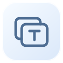
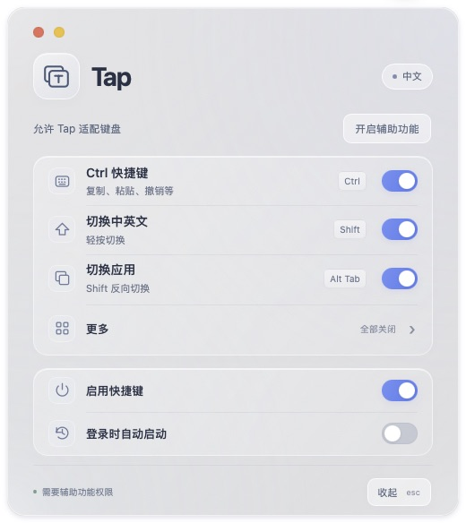

<p align="center">
  
</p>

# Tap

[简体中文](README.md) · [English](README.en.md)

Bring familiar Windows keys to your Mac. **Tap is now a standalone macOS application**: download one `Tap.app`, with no Hammerspoon, Lua, or configuration scripts to install.



## Download and start

[Download standalone Tap (Apple Silicon + Intel)](https://github.com/shkienao-pixel/tap/releases/download/v0.2.0-beta.1/Tap-macOS.zip) · [Release notes](https://github.com/shkienao-pixel/tap/releases/tag/v0.2.0-beta.1)

1. Download and extract `Tap-macOS.zip`, then drag **Tap.app** into Applications.
2. Open Tap and click the Accessibility button. Allow **Tap** in macOS **System Settings → Privacy & Security → Accessibility**.
3. Click the window + T menu bar icon to open settings and choose your features.

Minimum system requirement: **macOS 13**. The distribution is a universal binary containing Apple Silicon and Intel architectures.

This is **0.2.0-beta.1**, signed locally but not yet signed with Apple Developer ID or notarized. macOS security checks may restrict a downloaded copy. Users needing signed distribution should wait for a production release; you can also build from source below. Launch and UI have been verified on Apple Silicon; real keyboard handling and Intel execution still require testing on authorized devices.

## Features

| Feature | Keys / action | Fresh-install default |
| --- | --- | --- |
| Ctrl shortcuts | Ctrl + C / V / X / A / Z / S / F, etc. | On |
| Chinese/English switching | Tap and release Shift | On |
| Native app switching | Alt + Tab; add Shift to reverse | On |
| Master switch | Pause or enable Tap shortcuts | On |
| Launch at login | Start Tap after login | **Off** |
| Additional shortcuts | Enable individually in “More” | **All off** |

- Alt + Tab uses the **native macOS application switcher**. It switches apps rather than listing every window within each app.
- Shift changes input sources on release, without an added delay. Holding it longer than 0.5 seconds, typing another character, or using another modifier cancels the switch.
- The window uses native macOS frosted glass. Individual shortcuts and “More” are grouped above the master switch and login startup.
- Settings and key handling stay local. Tap does not record typed content and requires no online account or web server.

## Keyboard mode and input sources

### Ctrl adaptation is built in

Choose a mode under **More → Keyboard modifiers**:

| Mode | When to use it |
| --- | --- |
| Adapt with Tap (由 Tap 适配) | A Windows keyboard with default macOS modifier settings. Tap swaps the Control / Command events produced by Ctrl / Windows keys |
| Already swapped in macOS (系统已交换) | Control / Command were previously swapped in macOS. Tap keeps the system result to avoid swapping twice |

At first launch, Tap checks saved system modifier mappings and attempts to select the matching mode. Verify the mode manually if you use multiple keyboards with different settings. Adaptation currently applies to system keyboard events and **does not distinguish individual devices**. Mac keyboard users can turn off “Ctrl shortcuts.”

The optional Ctrl and Windows-key shortcuts assume the Windows keyboard is adapted through one of these modes. Turning off Ctrl adaptation does not revert existing macOS modifier settings.

### Chinese/English input, Caps Lock, and scrolling

- Shift switching targets Apple **ABC** and **Simplified Chinese Pinyin**. Add both in macOS input source settings first. Third-party input methods are not configured.
- To use Caps Lock only for capitalization, turn off Caps Lock Chinese/English switching in macOS input settings.
- For Windows-style mouse scrolling, disable **Natural scrolling** in macOS mouse settings.

Caps Lock and mouse preferences remain system settings; Tap does not change them automatically.

## Additional shortcuts: opt in individually

| Feature | Physical Windows keys | Behavior and scope |
| --- | --- | --- |
| Move or select by word | Ctrl + ← / →; add Shift to select | Recognizable editable text controls |
| Delete by word | Ctrl + Backspace / Delete | Delete the previous/next word; editable controls only |
| Line/document navigation | Home / End; Ctrl + Home / End; optionally Shift | Move to line/document boundaries; editable controls only |
| Redo | Ctrl + Y | Command + Shift + Z; editable controls only |
| Browser tabs | Ctrl + Tab; add Shift to reverse | Supported browsers |
| Close window | Alt + F4 | Command + W; tabbed apps may close the current tab, without quitting the app |
| Rename file | F2 | Finder only; passes through while editing the name |
| Screenshot to clipboard | Win + Shift + S; Print Screen | System region/full-screen screenshots to clipboard |

Supported browser identifiers include Safari, Chrome, Edge, Firefox, Brave, Arc, Vivaldi, and Opera. Text-editing mappings exclude Finder and Terminal, iTerm2, Ghostty, Warp, Alacritty, and kitty.

Print Screen currently needs to send **F13**. F2/F4 must also arrive as function keys; some keyboards require Fn. Text mappings do not apply when an app does not expose a recognizable editable control. Adaptation pauses during secure password input.

## Controls and migration

- **Click the menu bar icon:** Open the panel; click again to hide it.
- **Right-click or Option/Alt-click:** Open the reconnect and quit menu.
- **Esc:** Return from “More,” or hide the main panel.
- **Close/hide the panel:** Keep running in the background; use the master switch to pause shortcuts.
- **Login startup:** Move Tap to Applications before enabling it. Complete approval in macOS Login Items if required.

When migrating, quit the old Hammerspoon/Tap configuration first to avoid running two keyboard listeners. The standalone app has its own preferences and does not import legacy switches. Select “Already swapped in macOS” if you previously changed the system modifier mapping. The legacy source remains in [Git history](https://github.com/shkienao-pixel/tap/tree/fe46fcf239dc525829d8533e6f4bf59b4e4a63ed); the current project maintains one Swift application codebase.

The settings interface currently uses Chinese. This English README documents its controls and behavior.

## Build from source

Requires macOS and Xcode or Command Line Tools with a Swift toolchain.

```sh
# Run tests from the repository root
swift test

# Build an app and ZIP for the current Mac architecture
sh Scripts/build-app.sh

# Build a universal Apple Silicon + Intel app
TAP_UNIVERSAL=1 sh Scripts/build-app.sh
```

Outputs: `dist/Tap.app` and `dist/Tap-macOS.zip`. Builds use local signing by default. Set `TAP_SIGN_IDENTITY` to use an available developer certificate; notarization is a separate step.

| Source | Purpose |
| --- | --- |
| `Sources/ShortcutCore/ShortcutEngine.swift` | Testable rules, Shift/Alt + Tab state, and optional mappings |
| `Sources/Tap/main.swift` | macOS keyboard listener, input sources, permissions, menu bar, glass window, and login startup |
| `Sources/Tap/Resources/panel.html` | Settings interface bundled inside the app; no separate user installation |
| `Tests/ShortcutCoreTests/` | Mock event tests; no real keystrokes or live preference changes |
| `Scripts/` | App packaging and icon generation |

Tests cover Shift taps, modifier combinations, Ctrl adaptation, system-swap mode, native Alt + Tab, optional shortcut scope, secure input, and key releases. Actual device and application compatibility still needs live verification.

## License

[MIT License](LICENSE). Tap uses macOS system frameworks and bundles no Hammerspoon or third-party runtime.
